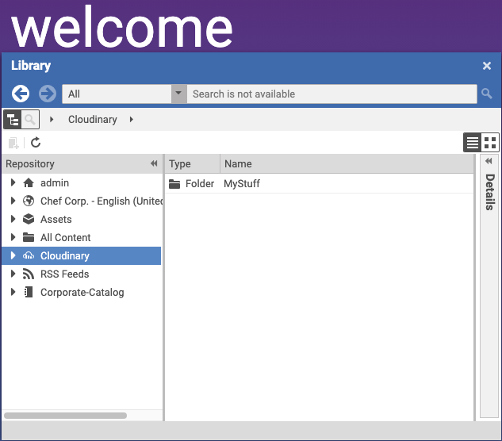
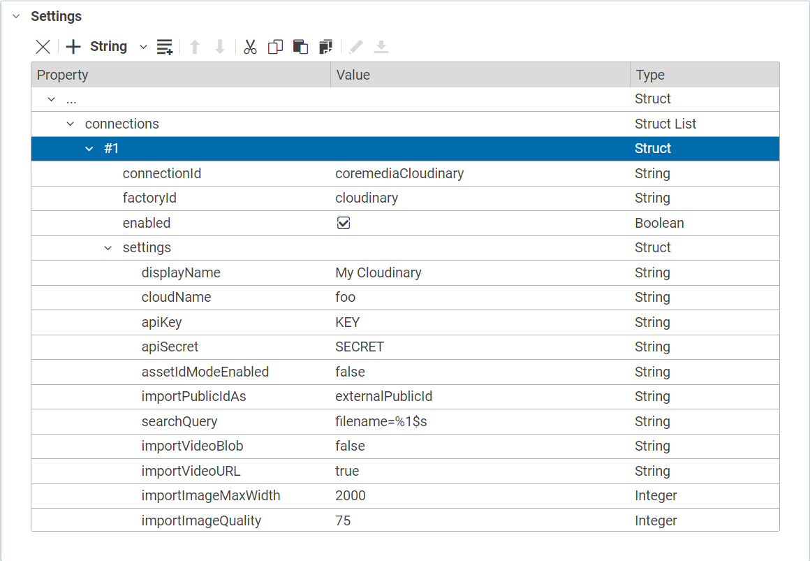
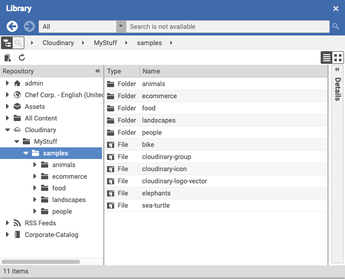
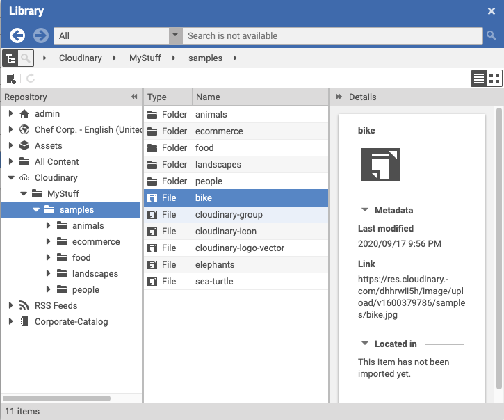

# Editorial Quick Start

--------------------------------------------------------------------------------

\[[Up](README.md)\] \[[Top](#top)\]

--------------------------------------------------------------------------------

## Table of contents

* [Introducing](#introducing)
* [Browsing the content-hub-adapter-coremedia](#browsing-the-content-hub-adapter-cloudinary)
    * [Basic adapter configuration](#basic-adapter-configuration)
        * [Global adapter configuration](#global-adapter-configuration)
        * [Site specific adapter configuration](#site-specific-adapter-configuration)
    * [Detailed adapter configuration](#detailed-adapter-configuration)
        * [Basic structure](#basic-structure)
        * [Required configuration](#required-configuration)
        * [Example](#example)     
* [Usage](#usage)    

## Introducing

As mentioned in the main documentation, the coremedia-content-hub-cloudinary plugin
provides access to a configurable Cloudinary account. Common to all
content-hub-adapters is the appearance in CoreMedia studio. The image below shows 
multiple configured content-hub-adapters in Studio (content-hub-adapter-cloudinary is marked with a blue background).

## Types of content working with this adapter
- Images
- Videos
  
## Browsing the content-hub-adapter-coremedia
Depending on the configuration of the adapter, the appearance of the tree may vary. The following sections 
take care of all configuration **places** and **options**.

### Basic adapter configuration
This section covers the two possibilities to enable the content-hub-adapter-cloudinary integration. Please note that those
options are valid for all content-hub-adapters. Before configuring the adapter, please refer to the documentation [Content hub configuration](https://documentation.coremedia.com/cmcc-10/artifacts/2004/webhelp/deployment-en/content/Studio-Contenthub-Configuration.html)
for preliminary steps.

#### Global adapter configuration
To enable the content-hub-adapter-cloudinary for all sites, it is necessary to create a CMSettings document inside the location:
* /Settings/Options/Settings/Content Hub/Connections/
For convenience reasons, naming proposal of this document is "Cloudinary" (name of the third party system)

#### Site specific adapter configuration
To enable the content-hub-adapter-cloudinary for a single site, it is necessary to create a CMSettings document inside the location:
* Options/Settings/Content Hub/Connections/ (relative to the site's root folder)
For convenience reasons, naming proposal of this document is "Cloudinary" (name of the third party system)

### Detailed adapter configuration

#### Basic structure
The table below shows the initial toplevel entry for all content-hub-connector configurations.

| Key         | Type       | Required   |
|-------------|------------|------------|
| connections | StructList | Yes        |

After creation of the initial struct list called **connections** the next step is to create the first entry. This can be done 
in Studio with the struct editor by pressing "add Item to ListProperty". The table below shows the entries which are common for all connectors.

| Key           | Type       | Value                 | Required   |
|---------------|------------|------------           |------------|
| connectionId  | String      | <SOME_UNIQUE_ID>     | Yes        |
| factoryId     | String      | <YOUR_FACTORY_ID>    | Yes        |
| enabled       | Boolean     | true or false        | Yes        |
| settings      | Struct     |                      | Yes        |
          

#### Required configuration
In section [Basic structure](#basic-structure) and according to the table, the settings struct is currently empty.
The settings struct itself holds specific configuration options for the connector (common to all connectors).
The table below depicts all potential entries. 

| Key               | Type       | Value                                                    | Required   |
|---------------    |------------|------------                                              |------------|
| displayName       | String     | Name of the root folder to display in Studio             | No         |
| cloudName         | String     | Account name to open a connection to Cloudinary          | Yes         |
| apiKey            | String     | API Key corresponding to the Cloudinary Account          | Yes         |
| apiSecret         | String     | API Secret corresponding to the Cloudinary Account       | Yes         |

#### Example
The image below depicts a full configuration of the content-hub-adapter-cloudinary in global space

## Usage
Once the connector is configured, the "Cloudinary" named tree appears in the library, and by clicking on "Cloudinary"
the tree expands and is showing loading and showing content from Cloudinary in the well-known folder-content structure from CoreMedia. The image below shows the appearance.

  

By browsing the tree, the content-hub-adapter-cloudinary provides an import mechanism for content objects. The picture below shows the 
button for creation (purple frame).

  
